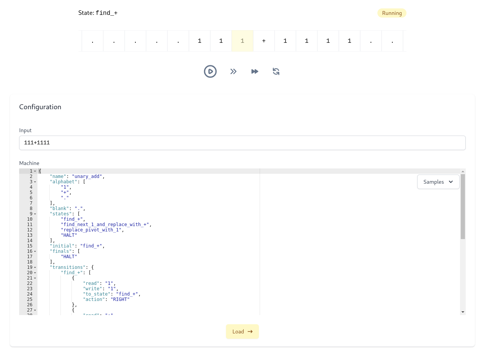

# Turing

## What is a Turing machine ?

> A Turing machine is a mathematical model of computation describing an abstract machine that manipulates symbols on a strip of tape according to a table of rules. Despite the model's simplicity, it is capable of implementing any computer algorithm. [Wikipedia](https://en.wikipedia.org/wiki/Turing_machine)

We then have a tape, where the machine input is injected.
A head reads every tape element, interpreting them based on machine configuration.

## The visualizer



[Open the visualizer →](https://turing.adonisenprovence.com/)

The visualizer requests machine execution to the server, which sends back the executed machine.
The client displays execution steps using smooth animations.

The input and the machine configuration can be edited. Some samples can be chosen. Configuration errors are shown to the user.

Several controls can be found on the visualizer:

- Pause and play
- Choose execution speed
- Run step by step
- Restart the execution

## The command line

You can execute Turing machine locally using the CLI:

```
_build/default/bin/turing run our-machines/02n.json "000"
Interpreter starting...
[<0>00] (one, 0) -> (two, 0, right)
[0<0>0] (two, 0) -> (one, 0, right)
[00<0>] (one, 0) -> (two, 0, right)
[000<.>] (two, .) -> (HALT, n, left)
[00<0>n] Final state reached !
Interpreter closing...
```

where `02n.json` contains:

```json
{
  "name": "02n",
  "alphabet": ["0", ".", "y", "n"],
  "blank": ".",
  "states": ["one", "two", "HALT"],
  "initial": "one",
  "finals": ["HALT"],
  "transitions": {
    "one": [
      { "read": "0", "write": "0", "to_state": "two", "action": "RIGHT" },
      { "read": ".", "write": "y", "to_state": "HALT", "action": "LEFT" }
    ],
    "two": [
      { "read": "0", "write": "0", "to_state": "one", "action": "RIGHT" },
      { "read": ".", "write": "n", "to_state": "HALT", "action": "LEFT" }
    ]
  }
}
```

## Universal Turing Machine

> In computer science, a universal Turing machine (UTM) is a Turing machine that simulates an arbitrary Turing machine on arbitrary input.
> [Wikipedia](https://en.wikipedia.org/wiki/Universal_Turing_machine)

It means we have to implement a machine configuration that allows the input to describe its own transitions and states.

### The input

An UTM input is composed as follows:

```
Initial-state~State_1{[Read To_State Action Write][Read To_State Action Write]...}...&Input
```

Where `{}` are state definition closure, `[]` are state transitions closure, `~` is the initial state separator and `&` is the input beginning.

### An Universal Turing Machine configuration

The UTM configuration must store in its definition the possible transitions that are allowed inside the input.
For example, you can find [the UTM that allows to run the above `02n.json`](our-machines/02n_utm.json).

Finally, you can run the `02n` UTM machine:

```txt
./_build/default/bin/turing run our-machines/02n_utm.json "E~E{[0P>0][_H<y]}P{[0E>0][_H<n]}&00"
Interpreter starting...
[<E>~E{[0P>0][_H<y]}P{[0E>0][_H<n]}&00] (retrieve_initial_state, E) -> (go-to-input-start-for_E, E, right)
[E<~>E{[0P>0][_H<y]}P{[0E>0][_H<n]}&00] (go-to-input-start-for_E, ~) -> (go-to-input-start-for_E, ~, right)
...
[E~E{[0P>0][_H<y]}P{[0E>0][_H<n]}&00<^>] (execute-transition-H_<_y, ^) -> (HALT, y, left)
[E~E{[0P>0][_H<y]}P{[0E>0][_H<n]}&0<0>y] Final state reached !
Interpreter closing...
```

Building an UTM configuration is really time-consuming and hardly maintainable. That's why we've implemented tools that allow the user to generate any kind of UTM needed.

[Universal Turing Machine tools documentation →](docs/technical.md#universal-turing-machine-tools)

## Docs

You can read more about running the project locally and technical details:

[See technical details →](docs/technical.md)

[See Setup →](docs/setup.md)
