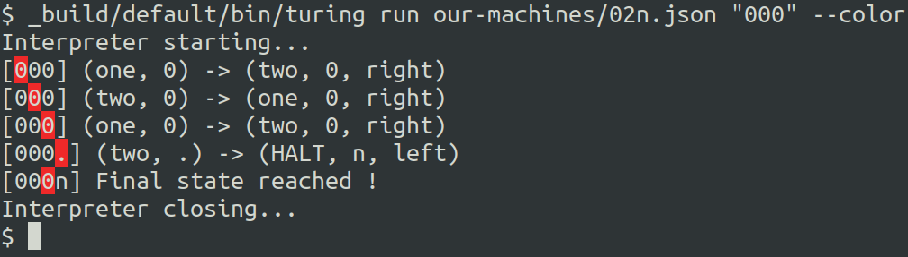

# Turing

## What is a Turing machine ?

> A Turing machine is a mathematical model of computation describing an abstract machine that manipulates symbols on a strip of tape according to a table of rules. Despite the model's simplicity, it is capable of implementing any computer algorithm. [Wikipedia](https://en.wikipedia.org/wiki/Turing_machine)

We then have a tape, where is injected the machine input.
A head that will read every tape element interpreting them base the defined machine configuration.

## The visualizer

GIF HERE

[Open the visualizer →](https://turing.adonisenprovence.com/)

The visualizer will request machine execution to our server, whom will send back the executed machine.
The client will interpret the resulting data and display it using human understandable animations.
From the client machine player you can find several controls:

- Choose execution speed
- Pause/Play
- Enter manual mode
- Reset

But also edit the input and machine configuration from the related text fields.
The client will notify the user about any machine nor input configuration error.

## The command line

You can execute Turing machine in local using the CLI.
Such as:

```
_build/default/bin/turing run our-machines/02n.json "000" --color
Interpreter starting...
[<0>00] (one, 0) -> (two, 0, right)
[0<0>0] (two, 0) -> (one, 0, right)
[00<0>] (one, 0) -> (two, 0, right)
[000<.>] (two, .) -> (HALT, n, left)
[00<0>n] Final state reached !
Interpreter closing...
```

where `02n.json` contains:

```json
{
  "name": "02n",
  "alphabet": ["0", ".", "y", "n"],
  "blank": ".",
  "states": ["one", "two", "HALT"],
  "initial": "one",
  "finals": ["HALT"],
  "transitions": {
    "one": [
      { "read": "0", "write": "0", "to_state": "two", "action": "RIGHT" },
      { "read": ".", "write": "y", "to_state": "HALT", "action": "LEFT" }
    ],
    "two": [
      { "read": "0", "write": "0", "to_state": "one", "action": "RIGHT" },
      { "read": ".", "write": "n", "to_state": "HALT", "action": "LEFT" }
    ]
  }
}
```

The CLI is called using the command `RUN`.
For big machine you might need to enable color mode.
To do so you can use the following flag:

- `--color` or `-c` will enable color mode.



## Docs

You can find more details about running the project in local and the technical details in below files:

[See technical details →](docs/technical.md)

[See Setup →](docs/setup.md)
